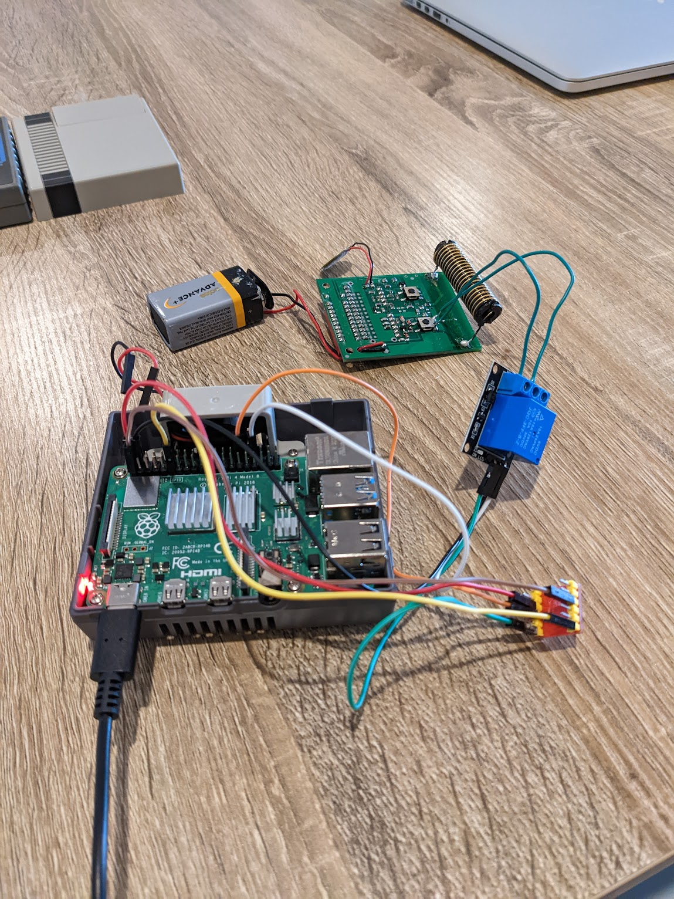

# Linky Garage

## Problem
- They fixed the parking garage door, and they gave us massive garage door remotes
- I don't want to carry around another thing

## Solution
- I bring my phone everywhere
- What if there was a website where I could open the garage

## Technology
- [RaspberryPi 4](https://www.raspberrypi.com/products/raspberry-pi-4-model-b/)
- [5V Relay](https://www.jaycar.com.au/arduino-compatible-5v-relay-board/p/XC4419?gclid=EAIaIQobChMI9ZitiICR-gIVl38rCh16oQiSEAQYASABEgKFwPD_BwE)
- [Logic Level Shifter](https://www.jaycar.com.au/arduino-compatible-logic-level-converter-module/p/XC4486?pos=1&queryId=dce2c08d3daac5c042adf8eba504341f)

## Hardware Plan
1. The garage door remote has hardware buttons
2. These buttons can be bypassed with some soldering and wires, and connecting these wires simulates a the open button press
3. The remote operates on a 9V battery, so I can't operate the button or the remote itself from the Pi
4. Turns out a "relay" can close circuits (even if the voltages differ)
5. The relay runs on a 5V digital (on/off) signal, but the Pi runs on 3V outputs
6. A logic level shifter can upscale or downscale digital signals
7. The Raspberry Pi has General Purpose In Out (GPIO) pins that can send a digital signal via software

## Software Plan
1. I like TypeScript
2. The `onoff` npm package, running on Node.js on the Pi can operate the GPIO pins
3. NextJS makes it quick and easy to spin up a React frontend and a connected backend API
4. The frontend can render a button that activates the backend route
5. The backend API route can toggle the pin

## Website and DNS Plan
1. The Raspberry Pi's public IP could change
2. Luckily there's [ddclient](https://github.com/ddclient/ddclient), which also happens to work with Namecheap, which updates the public IP every few minutes

## Helpful links
- [Dynamic IP config w/ namecheap](https://gist.github.com/christopherbaek/333146d953c87b3667c59c4e6e250454) 
- [Namecheap Dynamic IP support](https://www.namecheap.com/support/knowledgebase/article.aspx/595/11/how-do-i-enable-dynamic-dns-for-a-domain/)
- [Level Shifting](https://www.raspberrypi-spy.co.uk/2018/09/using-a-level-shifter-with-the-raspberry-pi-gpio/)
- [Raspberry Pi pins](https://pinout.xyz/)